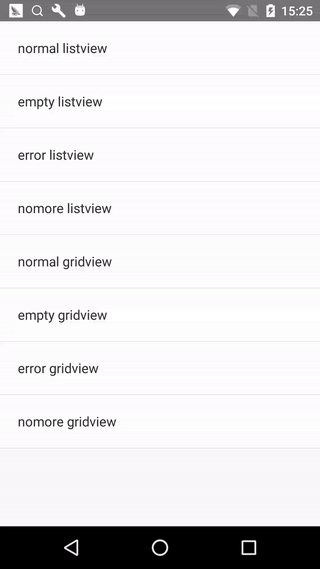

# react-native-easy-listview-gridview

[](https://badge.fury.io/js/react-native-easy-listview-gridview)

This is a wrapper library for **ListView & GridView** in React Native. 

### Sample

###### ListView



###### GridView


### Features

- **Pull to Refresh**
- **Load More** when reach the end fo listview or gridview
- **Custom Background** of listview or gridview when **Content is Empty**
- **Custom Style of RefreshControl**
- **Custom Header, Footer, Separator** and so on
- **TIMEOUT** Handler of loading
- **Optimization of Performance**
- **More coming soon!**

### Install

1. Run `npm install react-native-easy-listview-gridview --save`
2. import { EasyListView, EasyGridView } from 'react-native-easy-listview-gridview'

### Usage

[ListViewSample](https://github.com/danke77/react-native-easy-listview-gridview/blob/master/sample/js/ListViewSample.js)

###### ListView

``` javascript
import React, { Component } from 'react'
import {
  Text,
  View,
  TouchableHighlight
} from 'react-native'

import { EasyListView } from 'react-native-easy-listview-gridview'

export default class ListViewSample extends Component {
  constructor(props) {
    super(props)

    this.renderListItem = this._renderListItem.bind(this)
    this.renderGridItem = this._renderGridItem.bind(this)
    this.onFetch = this._onFetch.bind(this)
  }

  render() {
    return (
      <EasyListView
        ref={component => this.listview = component}
        renderItem={this.renderListItem}
        refreshHandler={this.onFetch}
        loadMoreHandler={this.onFetch}
        // other props
      />
    )
  }

  _renderListItem(rowData, sectionID, rowID, highlightRow) {
    return (
      <View
        style={Styles.rowContainer}>
        <TouchableHighlight
          style={{flex: 1}}
          onPress= {() => alert(rowData)}>
          <View
            style={Styles.rowContent}>
            <Text
              style={Styles.rowTitle}>
              {rowData}
            </Text>
          </View>
        </TouchableHighlight>
        <View style={Styles.separate}/>
      </View>
    )
  }

  _onFetch(pageNo, success, failure) {
    // ...
  }
}
```

###### GridView

``` javascript
import React, { Component } from 'react'
import {
  Text,
  View,
  TouchableHighlight
} from 'react-native'

import { EasyGridView } from 'react-native-easy-listview-gridview'

export default class GridViewSample extends Component {
  constructor(props) {
    super(props)

    this.renderListItem = this._renderListItem.bind(this)
    this.renderGridItem = this._renderGridItem.bind(this)
    this.onFetch = this._onFetch.bind(this)
  }

  render() {
    return (
      <EasyGridView
        ref={component => this.gridview = component}
        column={2}
        renderItem={this.renderGridItem}
        refreshHandler={this.onFetch}
        loadMoreHandler={this.onFetch}
        // other props
      />
    )
  }

  _renderGridItem(index, rowData, sectionID, rowID, highlightRow) {
    return (
      <View
        key={index}
        style={GridStyles.rowContainer}>
        <TouchableHighlight
          style={{flex: 1}}
          onPress= {() => alert(rowData)}>
          <View
            style={GridStyles.rowContent}>
            <Text
              style={GridStyles.rowTitle}>
              {rowData}
            </Text>
          </View>
        </TouchableHighlight>
      </View>
    )
  }

  _onFetch(pageNo, success, failure) {
    // ...
  }
}
```

## Props

- **`isDataFixed`** _(Bool)_ - Whether disable to pull to refresh and load more, default is false.
- **`autoRefresh`** _(Bool)_ - Whether call refresh in callback of `componentDidMount`, invalid when `isDataFixed` is true, default is true.
- **`timeout`** _(Integer)_ - Default is 10 seconds(10 * 1000 milliseconds).
- **`contentContainerStyle`** _(Object)_ - These styles will be applied to the scroll view content container which wraps all of the child views, the same with `ScrollView`.
- **`containerHeight`** _(Integer)_ - The height of listview or gridview, default is the height of window minus the height of status bar.
- **`containerWidth`** _(Integer)_ - The width of listview or gridview, default is the width of window.
- **`dataSizePerPage`** _(Integer)_ - The page size of listview or gridview, default is 10.
- **`rowHeight`** _(Integer)_ - The height of every row, used by `initialListSize` of `ListView`.
- **`pageSize`** _(Integer)_ - Number of rows to render per event loop, the same with `ListView`, default is 1.
- **`emptyContent`** _(String)_ - The text content of background when content is empty, default is `There is no content~`.
- **`renderEmpty`** _(Function)_ - Custom background when content is empty.
- **`onChangeVisibleRows`** _(Function)_ - Called when the set of visible rows changes, the same with `ListView`.
- **`renderSectionHeader`** _(Function)_ - The same with `ListView`.
- **`renderSeparator`** _(Function)_ - If provided, a sticky header is rendered for this section, the same with `ListView`.
- **`renderHeader`** _(Function)_ - The same with `ListView`.
- **`renderFooterNoMore`** _(Function)_ - Custom `renderFooter` when there is no more.
- **`renderFooterError`** _(Function)_ - Custom `renderFooter` when load more error.
- **`renderFooterLoading`** _(Function)_ - Custom `renderFooter` while loading more.
- **`renderItem`** _(Function)_ - The same with `renderRow` of `ListView`.
- **`onEndReachedThreshold`** _(Integer)_ - Threshold in pixels (virtual, not physical) for calling onEndReached, the same with `ListView`, default is 50.
- **`loadingTitle`** _(String)_ - The title displayed under the refresh indicator, only iOS, the same with `title` of `RefreshControl`, default is `loading...`.
- **`loadingTitleColor`** _(String)_ - The title color, only iOS, the same with `titleColor` of `RefreshControl`, default is `#9b9b9b`.
- **`loadingTintColor`** _(String)_ - The color of the refresh indicator, only iOS, the same with `tintColor` of `RefreshControl`, default is `#9b9b9b`.
- **`loadingColors`** _(Array)_ - The colors (at least one) that will be used to draw the refresh indicator, only Android, the same with `colors` of `RefreshControl`, default is `['red', 'red']`.
- **`loadingProgressBackgroundColor`** _(String)_ - The background color of the refresh indicator, only Android, the same with `progressBackgroundColor` of `RefreshControl`, default is `white`.
- **`loadFailContent`** _(String)_ - The text content when load more failed, default is `load fail...`.
- **`noMoreContent`** _(String)_ - The text content when there is no more, default is `There is no more~`.
- **`fixedData`** _(Array)_ - The data when disable to pull to refresh and load more, default is `[]`.
- **`refreshHandler`** _(Function)_ - The handler when pull to refresh.
- **`loadMoreHandler`** _(Function)_ - The handler when load more.
- **`responseDataHandler`** _(Function)_ - The handler of response data, default is return raw data.
- **`column`** _(Integer)_ - The column of gridview, when greater than 1, it is gridview, otherwise listview, default is 1.

### Contribution

**Issues** are welcome. Please add a screenshot of bug and code snippet. Quickest way to solve issue is to reproduce it on one of the examples.

**Pull requests** are welcome. If you want to change API or making something big better to create issue and discuss it first.

### License

_MIT_